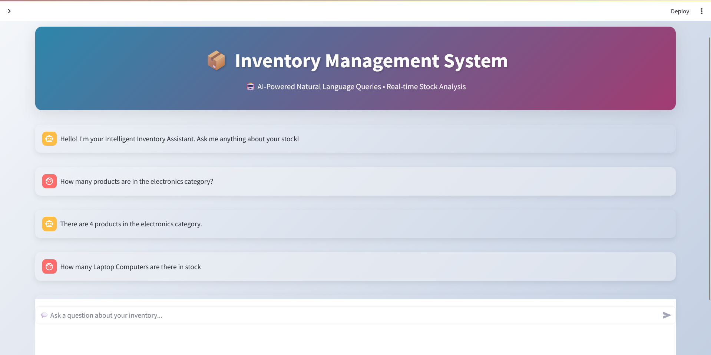

# 📦 InvenTell - Intelligent Inventory Agent

[](http://localhost:8501)
[](https://python.org)

> A conversational AI agent that transforms natural language questions into SQL queries for inventory analysis.

---

## 📸 Project Preview


---

## 🚀 Quick Start

### Prerequisites
- Python 3.8+
- OpenAI API key

### Installation & Setup

```bash
# 1. Create environment
python -m venv .venv
.venv\Scripts\activate  # Windows

# 2. Install dependencies
pip install -r requirements.txt

# 3. Configure API key
copy .env.example .env  # Add your OPENAI_API_KEY

# 4. Initialize database
python prepare_data.py

# 5. Launch application

streamlit run app.py
